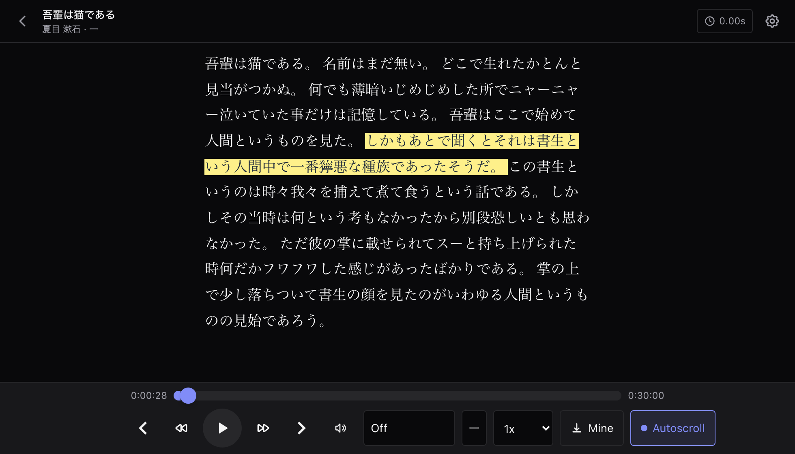
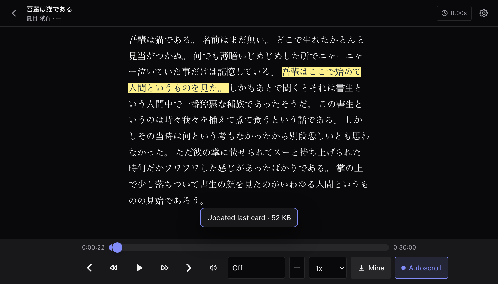
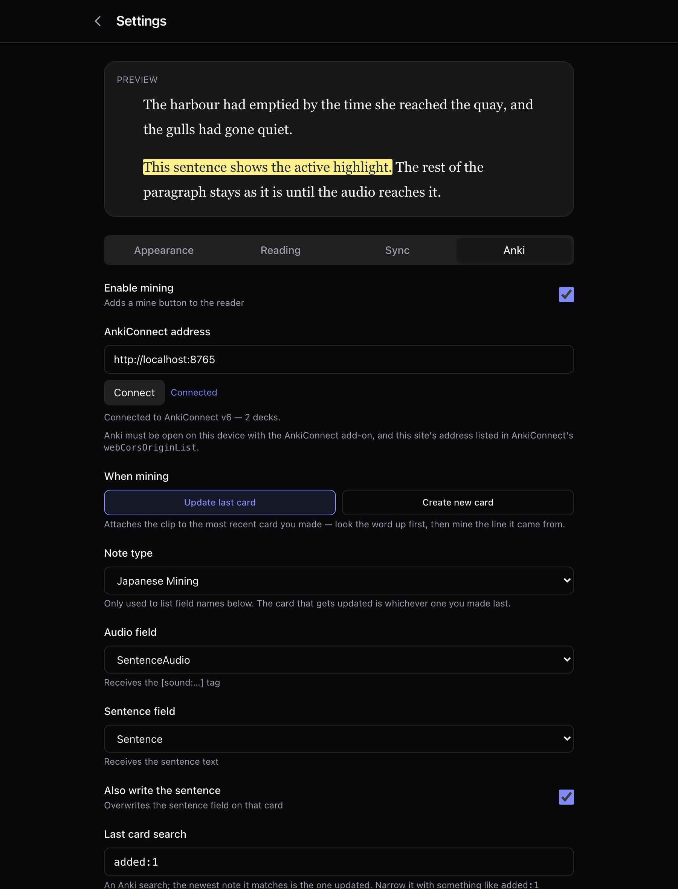
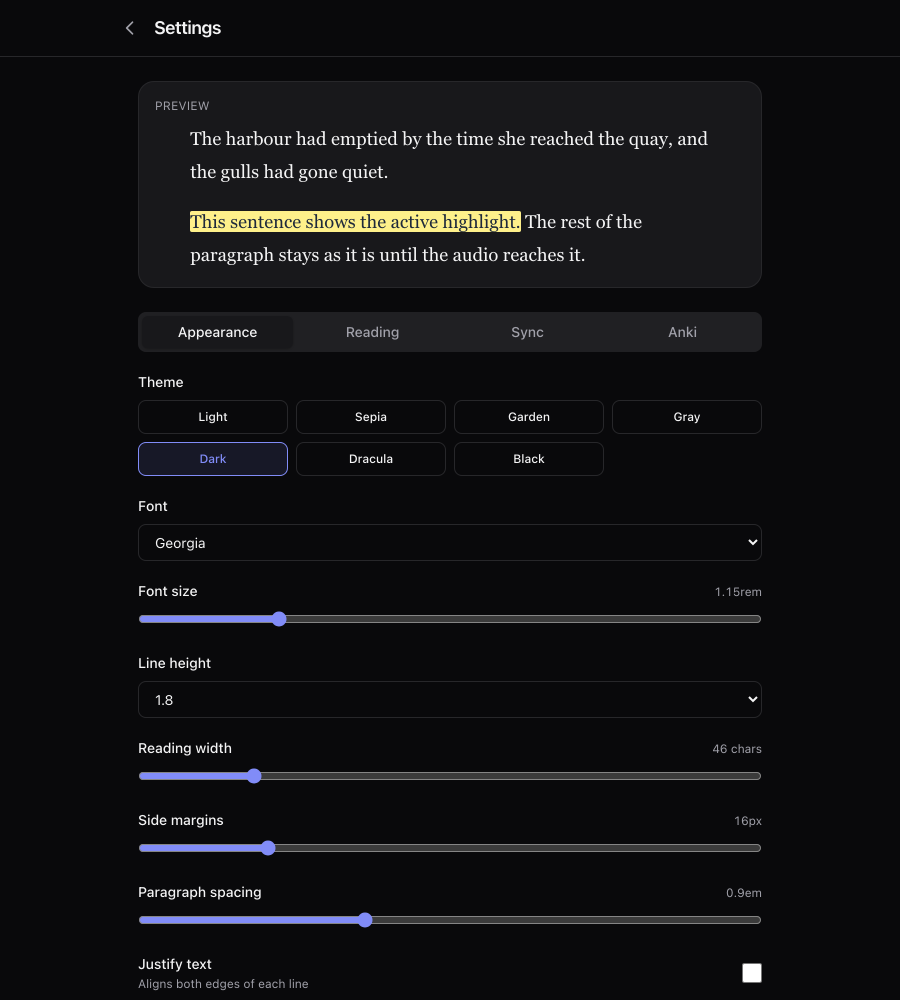

# Read-Along Reader

Read along with your audiobooks. A self-hosted web reader for
[Audiobookshelf](https://audiobookshelf.org) that shows a book's text beside its
audio, highlights each sentence as it is spoken, and — for language learners —
sends the sentence and its audio straight to Anki.

[](https://github.com/lambob01/read-along/actions/workflows/ci.yml)
[](LICENSE)



## Why

Listening and reading at the same time is one of the better ways to work through
a book in a language you are still learning — but it means juggling an audio
player and a separate copy of the text, and losing your place in one every time
you look at the other.

This keeps them together: the text scrolls itself, the current sentence stays
lit, and anything you want to study is one keypress from a flashcard.

## Features

**Reading**

- Sentence-level highlighting that follows the audio, with the page auto-scrolling to keep the current line in view
- Real book text from an attached EPUB — actual paragraphs, headings and ruby — timed by aligning it against a subtitle file
- Falls back to subtitle-only mode when there is no EPUB, inferring paragraphs from gaps in the audio
- Per-book sync offset for transcripts that run ahead of or behind the recording
- Seven themes, adjustable font, size, line height, margins, reading width and highlight colour

**Playback**

- Chapter navigation, variable speed, volume, sleep timer, and resume-where-you-left-off
- Immersive mode: the controls slide away while audio plays, leaving a slim progress line
- Installable as a PWA, and built as a static SPA that sits behind any reverse proxy

**Anki mining**

- One keypress adds the current sentence's audio to the card you just made, or creates a new card with the sentence and its audio
- Works on any line whether or not you have listened to it, and on any format the browser can play
- Configurable deck, note type, fields, tags, and how much lead-in and tail to keep

## Screenshots

| Mining a sentence                                         | Anki settings                                        |
| --------------------------------------------------------- | ---------------------------------------------------- |
|  |  |



## How it works

The reader needs two things from Audiobookshelf: the audio, and something that
says when each line is spoken.

1. **A subtitle file** (`.srt`/`.vtt`) attached to the book supplies the timing.
   Whisper output works well.
2. **An EPUB**, if one is attached, supplies the text. It is aligned against the
   subtitle character by character, so the book's own paragraphs and punctuation
   drive the display while the subtitle drives the clock. If alignment covers
   too little of the book, the reader falls back to the subtitle text alone.

Everything runs in the browser. The app is a static SPA and proxies
Audiobookshelf through `/abs/*`, so the browser never needs direct CORS access
to your server.

## Prerequisites

- [Node.js](https://nodejs.org) 22+
- An [Audiobookshelf](https://audiobookshelf.org) instance (v2.0+) with an API
  token, from **Settings → API Token**
- A book with a subtitle file attached, and ideally an EPUB
- For mining: [Anki](https://apps.ankiweb.net) with the
  [AnkiConnect](https://ankiweb.net/shared/info/2055492159) add-on

## Quick start

```bash
git clone https://github.com/lambob01/read-along.git
cd read-along
cp .env.example .env.local   # then set PUBLIC_ABS_ORIGIN to your ABS server
npm install
npm run dev
```

Open <http://localhost:5173>, enter your Audiobookshelf URL and API token, and
pick a book.

## Docker deployment

Caddy serves the built site and provisions HTTPS through Let's Encrypt.

```bash
# Point an A/AAAA record at this server first.
export SITE_DOMAIN=reader.your-domain.com
export ABS_ORIGIN=https://your-abs-server.com
docker compose up -d --build
```

| Variable      | Required        | Default                  | Description                          |
| ------------- | --------------- | ------------------------ | ------------------------------------ |
| `SITE_DOMAIN` | Yes (for HTTPS) | `reader.localhost`       | Domain Caddy serves on               |
| `ABS_ORIGIN`  | Yes             | `http://localhost:13378` | ABS server Caddy proxies `/abs/*` to |

Update with `git pull && docker compose up -d --build`.

For local development the equivalent is `PUBLIC_ABS_ORIGIN`, which is what the
Vite dev proxy forwards to.

## Anki mining

Enable it under **Settings → Anki**. Two modes:

- **Update last card** (default) — attaches the audio to the most recently
  created note. This matches the usual mining order: look a word up in a popup
  dictionary, make the card, then grab the audio for the line it came from.
- **Create new card** — makes a note containing the sentence and its audio.

Press **`a`** or the **Mine** button while a sentence is highlighted. A capture
takes about as long as the sentence does, because the audio is re-played to
obtain it; the button shows progress.

### AnkiConnect has to allow this page

AnkiConnect only answers browsers whose origin it has been told about. Add
yours in **Tools → Add-ons → AnkiConnect → Config**, then restart Anki:

```json
{
	"webCorsOriginList": ["http://localhost", "http://localhost:5173"]
}
```

Origins are matched exactly, port included, so a deployed instance needs its own
entry (`https://reader.your-domain.com`). Getting this wrong is the most common
reason mining reports that Anki is unreachable.

Anki runs on your own machine, so mining works wherever Anki is — not from a
phone pointed at a remote deployment.

## Keyboard shortcuts

| Key           | Action                    |
| ------------- | ------------------------- |
| `Space` / `k` | Play / pause              |
| `←` / `j`     | Back 10s                  |
| `→` / `l`     | Forward 10s               |
| `h`           | Back 5s                   |
| `n` / `p`     | Next / previous chapter   |
| `[` / `]`     | Nudge sync offset by 0.1s |
| `a`           | Mine sentence to Anki     |

## Development

```bash
npm run dev      # dev server
npm test         # unit tests
npm run check    # svelte-check
npm run lint     # prettier
npm run format   # prettier --write
```

Tests split by filename: `*.dom.test.ts` runs in jsdom (EPUB parsing, alignment,
rendering), everything else in Node.

`.claude/skills/verify/` holds a harness that runs the app against a fake
Audiobookshelf and a fake AnkiConnect, so the reader and the mining flow can be
exercised end to end without credentials or a real library.

Architecture notes for contributors — and for anyone wondering why the audio
capture works the way it does — are in [CLAUDE.md](CLAUDE.md).

## Tech stack

[SvelteKit](https://kit.svelte.dev) (adapter-static) · [Tailwind CSS
v4](https://tailwindcss.com) · TypeScript · Vite · Vitest ·
[Caddy](https://caddyserver.com)

## License

[MIT](LICENSE)
